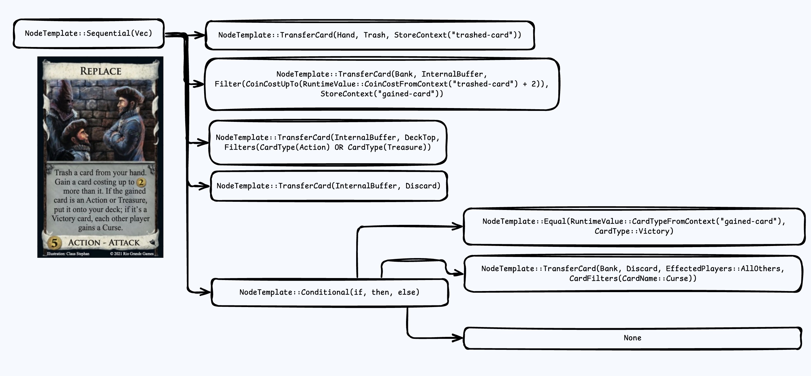

# dominion-engine
> A simple game engine for the card game Dominion

This is a hobby project used to learn more about large-scale Rust projects

## Goals
- Extendable cards
    - Able to define cards yourself
- Forwards/reversible history
- Modern language


## Usage

No external dependencies are required. Just run `cargo run` 

Example code:
```rust
// Create a new game
let mut new_game = game::Game::new();

// Add players
new_game.add_terminal_player("Jarvis".to_owned());
new_game.add_bot("Bot".to_owned());
// Set up the bank to be the "First Game" preset
new_game.set_bank(bank::Bank::first_game());

// Start the game
new_game.start_game();

while !new_game.is_finished() {
    new_game.get_next_step();
    new_game.print_status();
}

let player_names = new_game.get_player_names();
println!("Players: ");
println!("  {:#?}", player_names);

println!("\nMarket:");
if let Some(steps) = card::Card::market().get_steps() {
    new_game.run_steps(steps);
}
```

`Player` encapsulates all logic for what a player should do in a given situation.  

## High level overview

### Node
The game history is represented as a tree of nodes. Nodes are operations that will happen in a game, and should be atomic and simple. An example tree may look something like this:

```
Root
├─ Setup
│  ├─ +5 Cards
├─ Setup
│  ├─ +5 Cards
├─ Action (Player 1)
│  ├─ Village
│  │  ├─ +1 Card
│  │  ├─ +2 Actions
├─ Buy (Player 1)
│  ├─ Silver
│  │  ├─ +2 🪙
│  ├─ Gold
│  │  ├─ +3 🪙
├─ Action (Player 2)
│  ├─ Village
│  │  ├─ +1 Card
│  │  ├─ +2 Actions
├─ Buy (Player 2)
│  ├─ Copper
│  │  ├─ +1 🪙
│  ├─ Copper
│  │  ├─ +1 🪙
│  ├─ Copper
│  │  ├─ +1 🪙
│  ├─ BuyCard(Village)
```
Each node has a `NodeType` that explanin the operation that needs to happen
The actual operation of the node happens when the node is visited. 

### NodeTemplate

Steps on a card are stored as `NodeTemplate`s. These templates also defined as a tree

To add nodes to the tree, they must be converted from a `NodeTemplate` to a `Node`. Some mappings are simple, such as `NodeTemplate::PlusCoin(RuntimeI32) -> Node::PlusCoin(RuntimeI32)`, while others are more complex.

An good example to understand would be Throne Room. 
- The NodeTemplate for throne room is `NodeTemplate::RepeatCardXTimes(RuntimeI32, RuntimeCardName)`
- When converting from `NodeTemplate` to `Node`
    - The player chooses a card
    - The card steps are retrieved
    - Those steps are converted into nodes
    - The nodes are inserted into the
```
├─ Action (Player 2)
│  ├─ ThroneRoom (Village) 
│  │  ├─ +1 Card
│  │  ├─ +2 Actions
│  │  ├─ +1 Card
│  │  ├─ +2 Actions
```
This way the game history stays simple and reversible

There are a few key ideas to keep things organized
- `Node` does not contain any logic 
    - No "If x then y". This happens when converting from a NodeTemplate to a node
    - No Player Decisions
    - No Player Decisions
- All nodes should be reversible

### RuntimeI32, RuntimeCardName, RuntimeCardType

There are many pieces of information that will not be known until the card has already been played. Cellar, for example doesn't know how many cards need to be drawn until the player has discarded a certain number of cards. This is stored as a RuntimeXXXXX, which gets resolved as it is needed using the game state. 


### Context

One of the hardest things about this system is that there are often times where information needs to be passed between nodes in the tree. 
Remodel needs to know the cost of a card that was trashed, while Cellar needs to know the number of cards discarded. 
This boils down to steps needing to know what happened during previous steps, weather it was cost, value, type, or something else.
This problem is solved using a context HashMap stored in the `Game` struct. When you are going to need a piece of information, store it in the context hashmap. Then, you can extract that piece of information in a later step.


<figure>

<figcaption align="center"><b>Replace Card NodeTemplate example</b></figcaption>
</figure>
